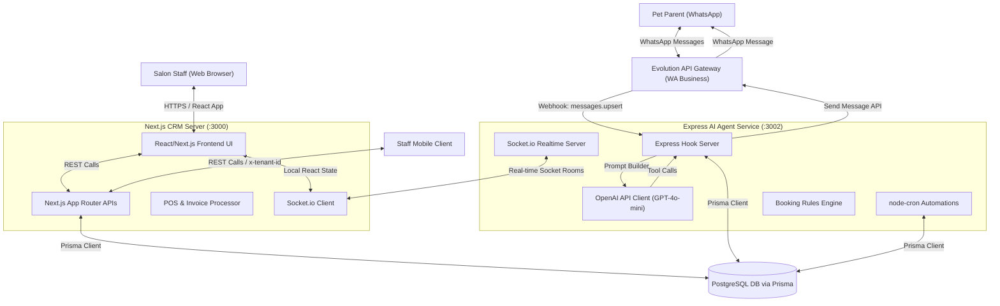
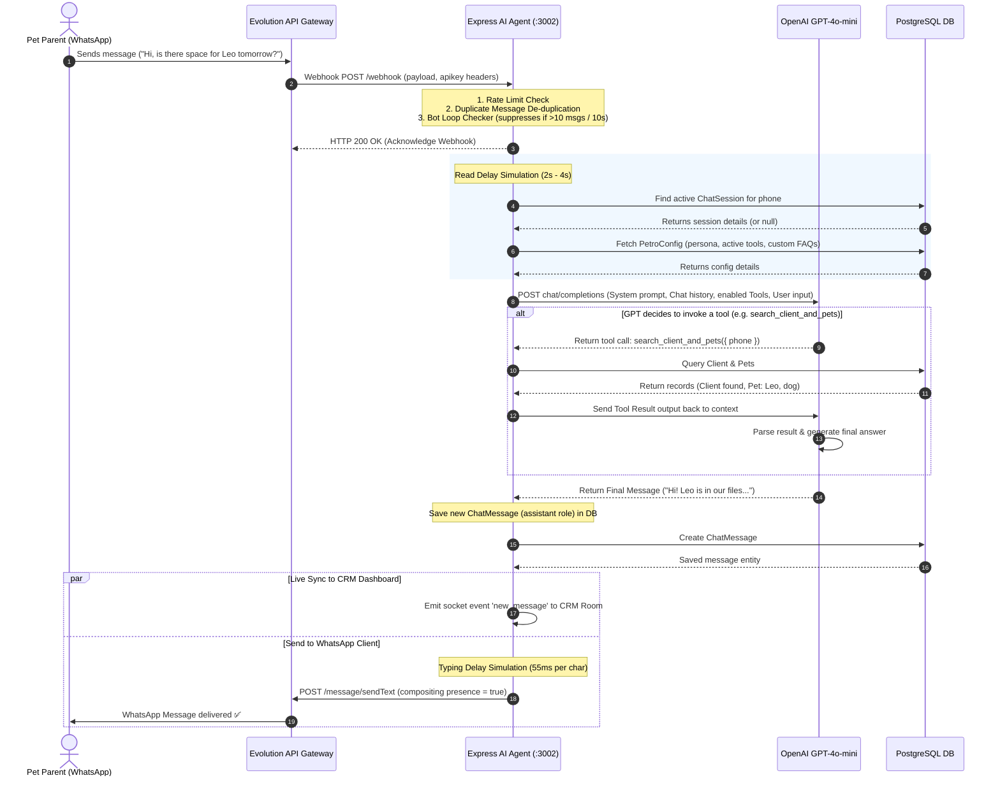
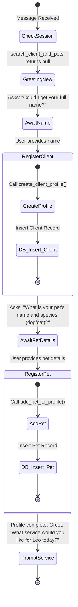
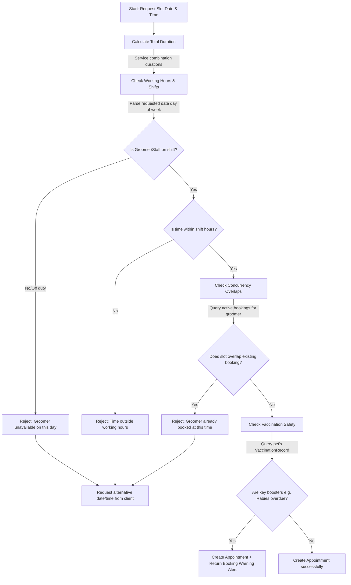
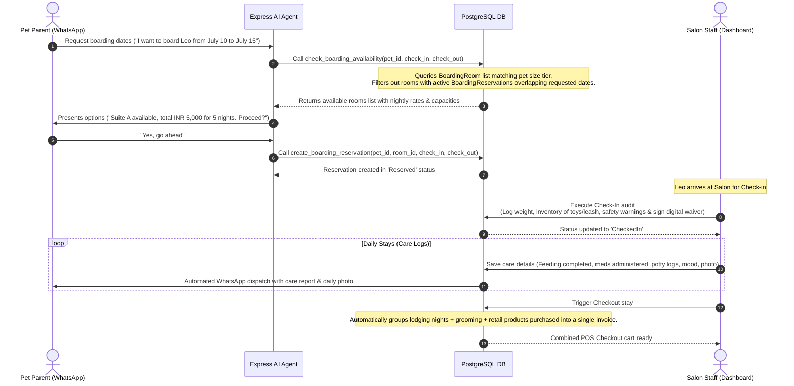
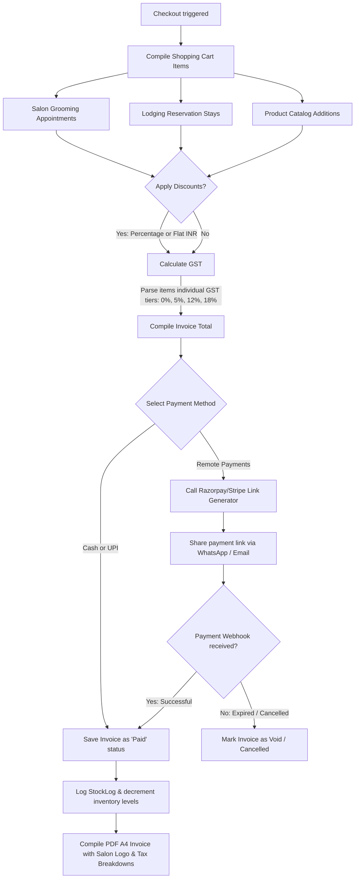
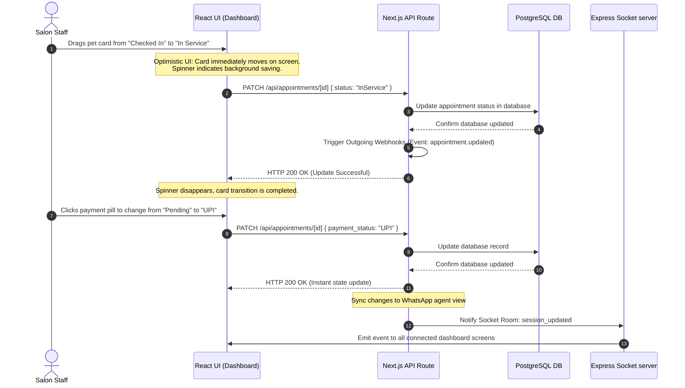
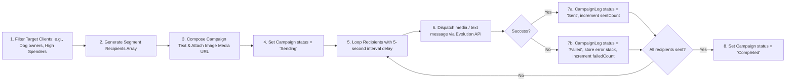
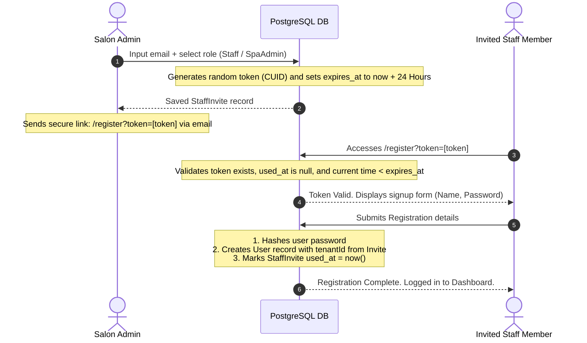
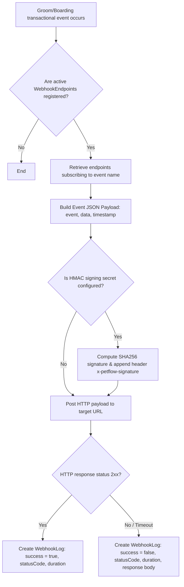

# 🐾 PetFlow CRM & WhatsApp AI Agent: System Design Document

This document provides a comprehensive technical overview of the **PetFlow** architecture, database schemas, API interfaces, and key transactional flows. PetFlow is a multi-tenant Pet Spa CRM combined with an automated, WhatsApp-powered AI front-desk receptionist.

---

## 1. System Architecture

PetFlow is built as a split-architecture system consisting of a client-facing Next.js CRM Dashboard (monolith/backend APIs) and a decoupled Express.js Node.js service dedicated to executing the WhatsApp AI Agent and background cron schedulers.



### Components Summary
1. **Next.js CRM Server**: The dashboard backend and frontend UI. Manages bookings, lodging rooms, visual pipelines, billing checks, Stripe/Razorpay integrations, and outgoing webhooks.
2. **Express AI Agent Service**: Receives WhatsApp event webhooks via the Evolution API, routes them to OpenAI's assistant engine (using tool-calling for DB operations), enforces booking rule checks, and runs background automated retention engines.
3. **Evolution API Gateway**: The bridge hosting WhatsApp web sessions, converting raw WhatsApp socket messages into standard webhook HTTP POST requests and executing text/media sending commands.
4. **PostgreSQL Database**: The shared database using **Prisma ORM** as the unified schema definition provider, maintaining strict multi-tenant constraints using `tenantId`.

---

## 2. Database Schema (Prisma Data Model)

PetFlow enforces strict logical multi-tenancy. Every core business entity points back to a central `Tenant` model via a `tenantId` field.

### Core Schemas & Models

| Model | Description | Major Relationships |
| :--- | :--- | :--- |
| **Tenant** | Represents a salon branch or customer company. | Has many `User`, `Client`, `Pet`, `Service`, `Product`, `Staff`, `Appointment`, `Invoice`, etc. |
| **Client** | Customer profiles containing WhatsApp number, total spend metrics, and contact info. | Belongs to `Tenant`, has many `Pet`, `Sale`, `Invoice`. |
| **Pet** | Registered pet profiles containing species, weight, breed, medical/temperament alerts. | Belongs to `Tenant` & `Client` (owner). Has many `Appointment`, `VaccinationRecord`, `BoardingReservation`. |
| **Service** | Salon services (e.g. Grooming, Bathing) with dynamic duration and size-based tier pricing. | Belongs to `Tenant`. |
| **Product** | Retail inventory items with category details, SKU, pricing, stock levels, and alert thresholds. | Belongs to `Tenant`, has many `Sale` and `StockLog`. |
| **Staff** | Salon workers, roles, and shift details (stored as JSON daily schedules). | Belongs to `Tenant`, has many `Appointment`. |
| **Appointment** | Scheduled pet salon groom sessions with status tracks, payment state, and before/after photos. | Belongs to `Tenant`, `Pet`, `Staff` (groomer), `BoardingReservation`. Has one `Invoice`. |
| **Invoice** | Financial receipts containing subtotal, tax rates, tax amounts, discount percentages/amounts, and payment method details. | Belongs to `Tenant`, `Client`. Has one `Appointment` or `BoardingReservation`. Has many `Sale` and `PaymentLink`. |
| **Sale** | Line items representing retail products sold, connected directly to an invoice. | Belongs to `Tenant`, `Invoice`, `Client`, `Product`, `BoardingReservation`. |
| **Settings** | Salon brand customizer (colors, working hours, currencies, boarding/retail toggles). | Belongs to `Tenant`. |
| **WhatsAppConfig** | API URLs and access tokens for Evolution API instances per tenant. | Belongs to `Tenant`. |
| **ChatSession** | Conversation sessions tracking WhatsApp customer states and active manual takeover flags. | Belongs to `Tenant`, `Client`. Has many `ChatMessage`. |
| **ChatMessage** | Chronological record of chat texts exchanging between client, agent, and tool returns. | Belongs to `ChatSession`. |
| **VaccinationRecord** | Tracks vaccine types (Rabies, DHPP, etc.), date administered, booster due dates, and compliance states. | Belongs to `Pet`. |
| **StockLog** | Audit trail of inventory updates (Sales, Replenishments, Damage/Loss). | Belongs to `Product`. |
| **Campaign** | Bulk WhatsApp broadcast logs, rich media templates, and target segment parameters. | Belongs to `Tenant`. Has many `CampaignLog`. |
| **CampaignLog** | Delivery outcome records per campaign customer (Sent vs Failed). | Belongs to `Campaign`. |
| **PetroConfig** | Fine-grained AI persona parameters, active system instructions, custom knowledge bases, and enabled tool arrays. | Belongs to `Tenant`. |
| **BoardingRoom** | Hotel boarding rooms categorised by size capacities, species filters, and nightly prices. | Belongs to `Tenant`. Has many `BoardingReservation`. |
| **BoardingReservation**| Overnight lodging details, check-in health audits, items checklists, and client signatures. | Belongs to `Tenant`, `BoardingRoom`, `Pet`. Has one `Invoice`. Has many `BoardingCareLog`, `Appointment`, `Sale`. |
| **BoardingCareLog** | Daily logs for boarded pets detailing feeding times, mood, potty, meds, and photos. | Belongs to `BoardingReservation`. |
| **User** | Portal user accounts (SuperAdmin, SpaAdmin, Staff) accessing the React dashboard. | Belongs to `Tenant`. Has many `StaffInvite` (sent). |
| **StaffInvite** | Multi-tenant user invite tokens with strict verification rules and expiry stamps. | Belongs to `Tenant`, belongs to `User` (inviter). |
| **PaymentLink** | Dynamic online payment sessions powered by Stripe or Razorpay API instances. | Belongs to `Tenant`, `Invoice`. |
| **PaymentConfig** | Stripe/Razorpay API integrations config. | Belongs to `Tenant`. |
| **WebhookEndpoint** | Target endpoints and event subscription arrays for third-party integrations (n8n/Zapier). | Belongs to `Tenant`. Has many `WebhookLog`. |
| **WebhookLog** | Transmission status, payloads, and response summaries from outgoing webhook calls. | Belongs to `WebhookEndpoint`. |

---

## 3. Core System Flows

### Flow 1: WhatsApp Webhook & Message Pipeline

Triggers every time a customer sends a message to the salon's WhatsApp number.



---

### Flow 2: Self-Service Client & Pet Registration Flow

Executes conversationally when a brand-new phone number interacts with the WhatsApp bot.



---

### Flow 3: Appointment Booking & Scheduling Engine Flow

Ensures all appointments checked by the AI agent or created on the dashboard validate business rules before booking.



---

### Flow 4: Pet Boarding & Lodging Flow

Manages overnight pet hotel bookings, capacity checks, daily care logs, and checkout.



---

### Flow 5: Unified POS Cart & Invoice Generation Flow

Handles retail sales, completed appointments, and lodging checks, generating GST-compliant bills and remote payment gateways.



---

### Flow 6: Visual CRM Kanban Board Pipeline

Operates with optimistic rendering to keep salon checkouts and groom state changes responsive.



---

### Flow 7: Automated Marketing & Cron Scheduler Engine

An automated background service that handles client communication, automated followups, and retention without staff intervention.

| Time (Daily) | Flow Name | Cron Pattern | Action / Flow Details |
| :--- | :--- | :--- | :--- |
| **Every Hour** | **2-Hour Appt Reminder** | `0 * * * *` | Finds active appointments scheduled for today in exactly 2 hours. Sends WhatsApp reminder text to owners. |
| **10:00 AM** | **Tomorrow's Reminders** | `0 10 * * *` | Queries appointments scheduled for tomorrow. Dispatches friendly reminder alerts with time and details. |
| **10:00 AM** | **Boarding Checklist** | `0 10 * * *` | Finds lodging stays checking in tomorrow. Dispatches packing lists (food details, meds, vaccine documents request). |
| **11:00 AM** | **6-Week Rebooking Engine** | `0 11 * * *` | Detects clients checked out exactly 6 weeks ago who have no future bookings. Invites them to rebook. |
| **12:00 PM** | **Vaccination Warnings** | `0 12 * * *` | 1. Marks past-due vaccines as `Overdue`. <br/>2. Marks boosters due in <= 14 days as `Due Soon`. <br/>3. Alerts owners with boosters due in exactly 14 days. |
| **6:00 PM** | **Feedback Request** | `0 18 * * *` | Scans checkout appointments completed today. Requests feedback and encourages sharing photo results. |

---

### Flow 8: Targeted Marketing Campaign Broadcasts

Allows salon owners to run target promotions over WhatsApp.



---

### Flow 9: Tenant Staff Invite Flow

Secures credentials creation inside the multi-tenant dashboard environment.



---

### Flow 10: Outgoing Webhook Event System

Dispatches business transactions to client workflows in Zapier, Make.com, or custom endpoints.



---

## 4. Real-time Live Synchronisation (Socket.io)

Socket.io connects the Express AI Agent and the Next.js CRM Dashboard to ensure customer text exchanges update instantly in the workspace.

*   **Socket Authentication**: Connection handshakes require a valid `PETFLOW_API_KEY` token passed within the headers.
*   **Socket Rooms**: Rooms are keyed by the database `ChatSession` ID.
*   **Synchronisation Lifecycle**:
    1.  **Dashboard Connection**: When a staff member loads the CRM Chats screen, the browser establishes a socket connection and joins the room matching the client's `ChatSession.id` using the socket event `join_session`.
    2.  **AI Message Arrival**: When the Express app processes a WhatsApp message, it writes the result as a new `ChatMessage` and broadcasts it to that specific room via:
        ```javascript
        io.to(session_id).emit('new_message', savedMessage);
        ```
    3.  **Real-time Update**: The dashboard's socket listener catches `new_message` and appends the message object directly to the message state array, giving the staff member instant updates of the conversation.
    4.  **Session Updates**: When the dashboard staff sends a message, they call the Next.js API, which writes to the database, sends the text via Evolution, and triggers `session_updated` via sockets so other open dashboard instances reflect the updated "Last Message" preview.

---

## 5. API Reference Summary

### Next.js CRM Backend API Route Map

*   **Authentication & Invites**:
    *   `POST /api/auth/...` - NextAuth session routes.
    *   `POST /api/webhooks` - Creates and manages webhook integrations.
*   **Mobile App API Hooks**:
    *   `GET /api/mobile/dashboard` - Fetches today's appointments, completed pets counts, and revenue. Requires header `x-tenant-id`.
    *   `POST /api/mobile/login` - Authenticates mobile app staff.
*   **Automation Crons**:
    *   `GET /api/cron/reminders` - Dispatches 2-hour appointment alerts.
    *   `GET /api/cron/boarding` - Sends tomorrow's check-in checklists.
    *   `GET /api/cron/vaccines` - Updates vaccine statuses and sends booster warnings.

### Express AI Agent API Map

*   `POST /webhook` - Receives Evolution API messages (payload contains event type `messages.upsert`).
*   `GET /health` - Health diagnostics showing active session counts and agent uptime.
*   `GET /api/sessions` - Returns list of all active chat sessions.
*   `GET /api/session/info?phone=...` - Queries details of an active memory state.
*   `POST /api/session/clear` - Clears conversation memory for a phone number.
*   `GET /api/petro-config` - Fetches the active configuration.
*   `PUT /api/petro-config` - Saves custom prompt settings and invalidates agent cache.
*   `POST /api/petro-config/chat-preview` - Simulates playground chat to test agent prompts.
